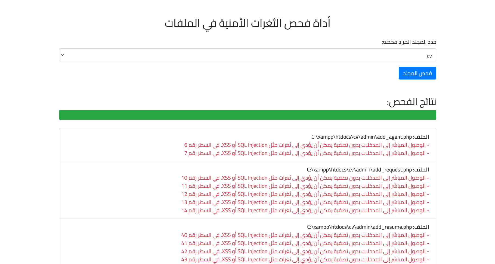

# أداة فحص الثغرات الأمنية في الملفات والموقع

هذه الأداة تستخدم لفحص الملفات البرمجية في موقعك بحثًا عن الثغرات الأمنية الشائعة. تدعم الأداة واجهة مستخدم بلوحة تحكم تسهل اختيار المجلدات وبدء الفحص.

## المتطلبات
- PHP 7.0 أو أعلى
- خادم ويب يدعم PHP (مثل Apache أو Nginx)
- مكتبة Composer (اختياري للتنصيب السريع)

## كيفية الاستخدام
1. أرفع الملف security_scan_tool.php داخل www
2. تأكد من أن لديك صلاحيات الوصول لقراءة جميع المجلدات والملفات.
3. افتح صفحة الأداة من متصفحك.
4. اختر المجلد الذي تريد فحصه واضغط على زر "فحص المجلد".

## نتائج الفحص
- ستظهر قائمة بالملفات التي تحتوي على ثغرات أمنية، مع تفاصيل عن نوع الثغرة ورقم السطر الذي تم العثور فيه على الثغرة.

## لقطة شاشة

## المساهمة
يمكنك المساهمة بتحسين الأداة عن طريق فتح طلبات السحب (Pull Requests) في مستودع GitHub.

## حقوق الملكية
- RAKAN ALYAMI - Telegram: @r7000r - Email: rakan7777@gmail.com
